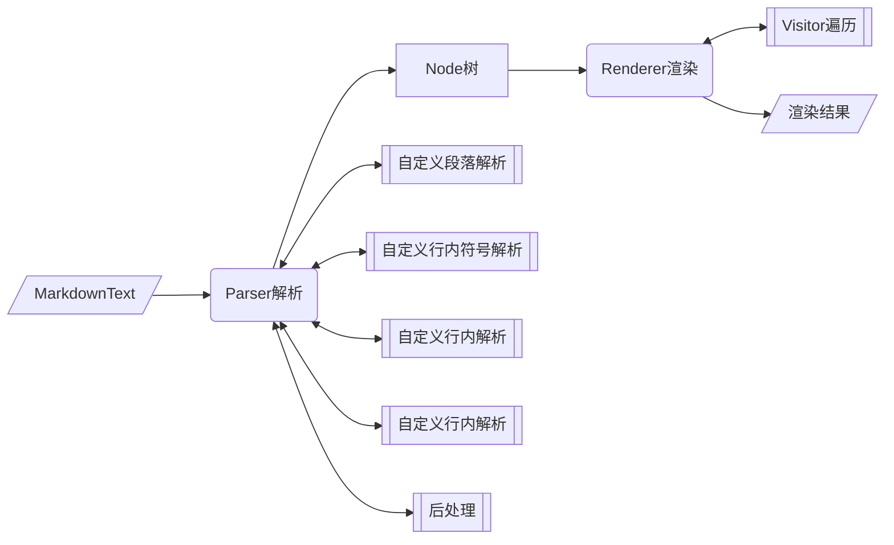

## commonmark4cj 库



### 介绍

根据CommonMark规范（以及一些扩展）解析和呈现Markdown文本。

### 1 Node

前置条件：NA 

场景：markdown解析得到的节点树，不同类型节点为不同的Node子类

约束：NA

可靠性：NA

#### 1.1 普通Node 通常为行内节点

##### 1.1.1 主要接口

```cangjie
/**
 * 通用节点
 */
public abstract class Node <: ToString & Equatable<Node> {
	
	/*
     * 添加操作行为
     * 参数 Visitor - 具体的操作行为
     */
    public open func accept(visitor: Visitor): Unit
	
	/*
     * 获取下一个节点
     * 返回值 ?Node - Option Node 下一个节点
     */
    public func getNext(): ?Node

	/*
     * 获取上一个节点
     * 返回值 ?Node - Option Node 上一个节点
     */
    public func getPrevious(): ?Node
	
	/*
     * 获取第一个孩子节点
     * 返回值 ?Node - Option Node 第一个孩子节点
     */
    public func getFirstChild(): ?Node
    
	/*
     * 获取最后一个孩子节点
     * 返回值 ?Node - Option Node 最后一个孩子节点
     */
    public func getLastChild(): ?Node
	/*
     * 获取父节点
     * 返回值 ?Node - Option Node 父节点
     */
    public open func getParent(): ?Node
	/*
     * 末尾添加子节点
     * 参数 Node - 子节点
     */
    public func appendChild(child: Node): Unit
    /*
     * 开头添加子节点
     * 参数 Node - 子节点
     */
    public func prependChild(child: Node): Unit
    /*
     * 断开连接
     */
    public func unlink(): Unit
    
    /*
     * 后插入一个兄弟节点
     * 参数 Node - 兄弟节点
     */
    public func insertAfter(sibling: Node): Unit
    /*
     * 前插入一个兄弟节点
     * 参数 Node - 兄弟节点
     */
    public func insertBefore(sibling: Node): Unit
	/*
     * toString
     * 返回值 String - toString
     */
    public open func toString(): String
	/*
     * 重写 == 
     * 参数 Node - 比较Node
     * 返回值 Bool - 是否相等
     */
    public operator func ==(other: Node): Bool
	/*
     * 重写 != 
     * 参数 Node - 比较Node
     * 返回值 Bool - 是否相等
     */
    public operator func !=(other: Node): Bool
}

/**
 * 文本节点
 */
public class Text <: Node & Equatable<Text> {
    public init(literal: String): Unit
	/*
     * 添加操作行为
     * 参数 Visitor - 具体的操作行为
     */
    public override func accept(visitor: Visitor): Unit
	/*
     * 获取文本
     * 返回值 String - 文本
     */
    public func getLiteral(): String
   	/*
     * 设置文本
     * 参数 String - 文本
     */
    public func setLiteral(literal: String): Unit
	/*
     * 重写 == 
     * 参数 Text - 比较Text
     * 返回值 Bool - 是否相等
     */
    public operator func ==(other: Text): Bool
	/*
     * 重写 != 
     * 参数 Text - 比较Text
     * 返回值 Bool - 是否相等
     */
    public operator func !=(other: Text): Bool
}

/**
 * HtmlInline节点
 */
public class HtmlInline <: Node {
    public init(literal: String): Unit
	/*
     * 添加操作行为
     * 参数 Visitor - 具体的操作行为
     */
    public override func accept(visitor: Visitor): Unit
  	/*
     * 获取文本
     * 返回值 String - 文本
     */
    public func getLiteral(): String
   	/*
     * 设置文本
     * 参数 String - 文本
     */
    public func setLiteral(literal: String): Unit
}

/**
 * CustomNode节点
 */
public abstract class CustomNode <: Node {
	/*
     * 添加操作行为
     * 参数 Visitor - 具体的操作行为
     */
    public override func accept(visitor: Visitor): Unit
}
/**
 * 图片节点
 */
public class Image <: Node {
	/*
     * 初始化
     * 参数 String - 图片地址链接
     * 参数 ?String - 标题
     */
    public init(destination: String, title: ?String)
	/*
     * 添加操作行为
     * 参数 Visitor - 具体的操作行为
     */
    public override func accept(visitor: Visitor): Unit
    /*
     * 获取地址链接
     * 返回值 String - 地址链接
     */
    public func getDestination(): String
	/*
     * 设置地址链接
     * 参数 String - 地址链接
     */
    public func setDestination(destination: String): Unit
    /*
     * 获取标题
     * 返回值 ?String - 标题
     */
    public func getTitle(): ?String
	/*
     * 设置标题
     * 参数 String - 标题
     */
    public func setTitle(title: String): Unit
}

/**
 * Code节点
 */
public class Code <: Node {
    public init(literal: String): Unit
	/*
     * 添加操作行为
     * 参数 Visitor - 具体的操作行为
     */
    public override func accept(visitor: Visitor): Unit
	/*
     * 获取文本
     * 返回值 String - 文本
     */
    public func getLiteral(): String
   	/*
     * 设置文本
     * 参数 String - 文本
     */
    public func setLiteral(literal: String): Unit
}

/**
 * HardLineBreak节点
 */
public class HardLineBreak <: Node {
	/*
     * 添加操作行为
     * 参数 Visitor - 具体的操作行为
     */
    public override func accept(visitor: Visitor): Unit
}

/**
 * SoftLineBreak节点
 */
public class SoftLineBreak <: Node {
	/*
     * 添加操作行为
     * 参数 Visitor - 具体的操作行为
     */
    public override func accept(visitor: Visitor): Unit
}

/**
 * Link节点
 */
public class Link <: Node {
    public init(destination: String, title: ?String)
	/*
     * 添加操作行为
     * 参数 Visitor - 具体的操作行为
     */
    public override func accept(visitor: Visitor): Unit
    /*
     * 获取目标地址
     * 返回值 String - 目标地址
     */
    public func getDestination(): String
	/*
     * 设置目标地址
     * 参数 String - 目标地址
     */
    public func setDestination(destination: String): Unit
    /*
     * 获取标题
     * 返回值 ?String - 标题
     */
    public func getTitle(): ?String
	/*
     * 设置标题
     * 参数 String - 标题
     */
    public func setTitle(title: String): Unit

}

/**
 * 分隔符接口
 */
public interface Delimited {
    /*
     * 获取开头分隔符
     * 返回值 ?String - 标题
     */
    func getOpeningDelimiter(): ?String
    /*
     * 获取结尾分隔符
     * 返回值 ?String - 标题
     */
    func getClosingDelimiter(): ?String
}

/**
 * StrongEmphasis节点
 */
public class StrongEmphasis <: Node & Delimited {
	/*
     * 初始化
     */
    public init(): Unit
	/*
     * 初始化
     * 参数 String - 分隔符
     */
    public init(delimiter: String): Unit
	/*
     * 设置分隔符
     * 参数 String - 分隔符
     */
    public func setDelimiter(delimiter: String): Unit
    /*
     * 获取开头分隔符
     * 返回值 ?String - 标题
     */
    public func getOpeningDelimiter(): ?String
    /*
     * 获取结尾分隔符
     * 返回值 ?String - 标题
     */
    public func getClosingDelimiter(): ?String
	/*
     * 添加操作行为
     * 参数 Visitor - 具体的操作行为
     */
    public override func accept(visitor: Visitor): Unit
}

public class Emphasis <: Node & Delimited {
	/*
     * 初始化
     */
    public init()
	/*
     * 初始化
     * 参数 String - 分隔符
     */
    public init(delimiter: String)
	/*
     * 设置分隔符
     * 参数 String - 分隔符
     */
    public func setDelimiter(delimiter: String): Unit
    /*
     * 获取开头分隔符
     * 返回值 ?String - 标题
     */
    public func getOpeningDelimiter(): ?String
    /*
     * 获取结尾分隔符
     * 返回值 ?String - 标题
     */
    public func getClosingDelimiter(): ?String
	/*
     * 添加操作行为
     * 参数 Visitor - 具体的操作行为
     */
    public override func accept(visitor: Visitor): Unit
}
```

#### 1.2 Block系列节点

##### 1.2.1 主要接口

```cangjie
public abstract class Block <: Node {
	/*
     * 获取父节点
     * 返回值 ?Node - Option Node 父节点
     */
    public func getParent(): ?Node
	/*
     * 设置父节点
     * 参数 Node - 父节点
     */
    protected override func setParent(parent: Node): Unit
}

public class BlockQuote <: Block {
	/*
     * 添加操作行为
     * 参数 Visitor - 具体的操作行为
     */
    public func accept(visitor: Visitor): Unit
}

public class HtmlBlock <: Block {
	/*
     * 添加操作行为
     * 参数 Visitor - 具体的操作行为
     */
    public func accept(visitor: Visitor): Unit
	/*
     * 获取文本
     * 返回值 String - 文本
     */
    public func getLiteral(): String
   	/*
     * 设置文本
     * 参数 String - 文本
     */
    public func setLiteral(literal: String): Unit
}

public abstract class CustomBlock <: Block {
	/*
     * 添加操作行为
     * 参数 Visitor - 具体的操作行为
     */
    public func accept(visitor: Visitor): Unit
}

public class ThematicBreak <: Block {
	/*
     * 添加操作行为
     * 参数 Visitor - 具体的操作行为
     */
    public func accept(visitor: Visitor): Unit
}

public class Document <: Block {
	/*
     * 添加操作行为
     * 参数 Visitor - 具体的操作行为
     */
    public func accept(visitor: Visitor): Unit
}

public class Paragraph <: Block {
	/*
     * 添加操作行为
     * 参数 Visitor - 具体的操作行为
     */
    public func accept(visitor: Visitor): Unit
}

public class IndentedCodeBlock <: Block {
	/*
     * 添加操作行为
     * 参数 Visitor - 具体的操作行为
     */
    public func accept(visitor: Visitor): Unit
	/*
     * 获取文本
     * 返回值 String - 文本
     */
    public func getLiteral(): String
   	/*
     * 设置文本
     * 参数 String - 文本
     */
    public func setLiteral(literal: String): Unit
}

public class FencedCodeBlock <: Block {
	/*
     * 添加操作行为
     * 参数 Visitor - 具体的操作行为
     */
    public func accept(visitor: Visitor): Unit
	/*
     * 获取围栏字符 默认`
     * 返回值 Rune - 围栏字符
     */
    public func getFenceChar(): Rune
   	/*
     * 设置围栏字符
     * 参数 Rune - 围栏字符
     */
    public func setFenceChar(fenceChar: Rune): Unit
	/*
     * 获取围栏代码块长度 至少3
     * 返回值 Int64 - 围栏代码块长度
     */
    public func getFenceLength(): Int64
   	/*
     * 设置围栏代码块长度
     * 参数 Int64 - 围栏代码块长度
     */
    public func setFenceLength(fenceLength: Int64): Unit
	/*
     * 获取围栏与代码块的缩进量
     * 返回值 Int64 - 围栏与代码块的缩进量
     */
    public func getFenceIndent(): Int64
   	/*
     * 设置围栏与代码块的缩进量
     * 参数 Int64 - 围栏与代码块的缩进量
     */
    public func setFenceIndent(fenceIndent: Int64): Unit
	/*
     * 获取语言标识符
     * 返回值 String - 语言标识符
     */
    public func getInfo(): String
   	/*
     * 设置语言标识符
     * 参数 String - 语言标识符
     */
    public func setInfo(info: String): Unit
	/*
     * 获取文本
     * 返回值 String - 文本
     */
    public func getLiteral(): String
   	/*
     * 设置文本
     * 参数 String - 文本
     */
    public func setLiteral(literal: String): Unit
}

public class ListItem <: Block {
	/*
     * 添加操作行为
     * 参数 Visitor - 具体的操作行为
     */
    public func accept(visitor: Visitor): Unit
}

public class Heading <: Block {
	/*
     * 添加操作行为
     * 参数 Visitor - 具体的操作行为
     */
    public func accept(visitor: Visitor): Unit
	/*
     * 获取标题级别
     * 返回值 Int64 - 标题级别
     */
    public func getLevel(): Int64
   	/*
     * 设置标题级别
     * 参数 Int64 - 标题级别
     */
    public func setLevel(level: Int64): Unit
}
/**
 * 列表块节点
 */
public abstract class ListBlock <: Block {
	/*
     * 获取表块是不是紧凑的
     * 返回值 Bool - 列表块是不是紧凑的
     */
    public func isTight(): Bool
   	/*
     * 设置列表块是不是紧凑的
     * 参数 Bool - 列表块是不是紧凑的
     */
    public func setTight(tight: Bool)
}
/**
 * 无序列表块节点
 */
public class BulletList <: ListBlock {
   	/*
     * 初始化
     * 参数 Rune - 标记
     */
    public init(bulletMarker: Rune): Unit
  	/*
     * 添加操作行为
     * 参数 Visitor - 具体的操作行为
     */
    public func accept(visitor: Visitor): Unit
		
	/*
     * 获取标记
     * 返回值 Rune - 标记
     */
    public func getBulletMarker(): Rune
   	/*
     * 设置标记
     * 参数 Rune - 标记
     */
    public func setBulletMarker(bulletMarker: Rune): Unit
}
/**
 * 有序列表块节点
 */
public class OrderedList <: ListBlock {
   	/*
     * 初始化
     * 参数 Int64 - 起始数字
     * 参数 Rune - 分隔符
     */
    public init(startNumber: Int64, delimiter: Rune)
	/*
     * 添加操作行为
     * 参数 Visitor - 具体的操作行为
     */
    public func accept(visitor: Visitor): Unit
	/*
     * 获取起始数字
     * 返回值 Int64 - 起始数字
     */
    public func getStartNumber(): Int64
   	/*
     * 设置起始数字
     * 参数 Int64 - 起始数字
     */
    public func setStartNumber(startNumber: Int64): Unit
	/*
     * 获取分隔符
     * 返回值 Rune - 分隔符
     */
    public func getDelimiter(): Rune
   	/*
     * 设置分隔符
     * 参数 Rune - 分隔符
     */
    public func setDelimiter(delimiter: Rune): Unit
}

/**
 * LinkReferenceDefinition节点
 */
public class LinkReferenceDefinition <: Block {
	/*
     * 初始化
     */
    public init()
	/*
     * 添加操作行为
     * 参数 String - 链接引用的标签
     * 参数 String - 目标地址
     * 参数 String - 标题
     */
    public init(label: String, destination: String, title: String)
	/*
     * 获取链接引用的标签
     * 返回值 ?String - 链接引用的标签
     */
    public func getLabel(): ?String
	/*
     * 设置链接引用的标签
     * 参数 String - 链接引用的标签
     */
    public func setLabel(label: String): Unit
    /*
     * 获取目标地址
     * 返回值 String - 目标地址
     */
    public func getDestination(): String
	/*
     * 设置目标地址
     * 参数 String - 目标地址
     */
    public func setDestination(destination: String): Unit
    /*
     * 获取标题
     * 返回值 ?String - 标题
     */
    public func getTitle(): ?String
	/*
     * 设置标题
     * 参数 String - 标题
     */
    public func setTitle(title: String): Unit
	/*
     * 添加操作行为
     * 参数 Visitor - 具体的操作行为
     */
    public override func accept(visitor: Visitor): Unit
}
```

##### 1.2.2 示例

```cangjie
    import commonmark4cj.commonmark.*
    
    @TestCase
    func documentTest(): Unit {
        var document: Document = Document ()
        var paragraph = Paragraph()
        var blockQuote = BlockQuote()
        var htmlBlock = HtmlBlock()
        var thematicBreak = ThematicBreak()
        var indentedCodeBlock = IndentedCodeBlock()
        var text = Text("text")

        document.appendChild(paragraph)
        document.appendChild(blockQuote)
        document.appendChild(htmlBlock)
        document.appendChild(thematicBreak)
        document.appendChild(indentedCodeBlock)
        document.appendChild(text)
        assertEquals("Document{}", blockQuote.getParent()().toString())
        assertEquals(None, document.getParent())

        htmlBlock.setLiteral("p1")
        assertEquals("p1", htmlBlock.getLiteral())

        assertEquals("HtmlBlock{}", thematicBreak.getPrevious()().toString())

        htmlBlock.insertBefore(Text("foo"))
        assertEquals("Text{literal=foo}", htmlBlock.getPrevious()().toString())

        assertEquals(true, paragraph != htmlBlock)
    }
```

#### 

#### 1.3 Visitor接口

##### 1.3.1 主要接口

```cangjie
public interface Visitor {
    func visit(blockQuote: BlockQuote): Unit

    func visit(bulletList: BulletList): Unit

    func visit(code: Code): Unit

    func visit(document: Document): Unit

    func visit(emphasis: Emphasis): Unit

    func visit(fencedCodeBlock: FencedCodeBlock): Unit

    func visit(hardLineBreak: HardLineBreak): Unit

    func visit(heading: Heading): Unit

    func visit(thematicBreak: ThematicBreak): Unit

    func visit(htmlInline: HtmlInline): Unit

    func visit(htmlBlock: HtmlBlock): Unit

    func visit(image: Image): Unit

    func visit(indentedCodeBlock: IndentedCodeBlock): Unit

    func visit(link: Link): Unit

    func visit(listItem: ListItem): Unit

    func visit(orderedList: OrderedList): Unit

    func visit(paragraph: Paragraph): Unit

    func visit(softLineBreak: SoftLineBreak): Unit

    func visit(strongEmphasis: StrongEmphasis): Unit

    func visit(text: Text): Unit

    func visit(linkReferenceDefinition: LinkReferenceDefinition): Unit

    func visit(customBlock: CustomBlock): Unit

    func visit(customNode: CustomNode): Unit
}

public abstract class AbstractVisitor <: Visitor {
	/*
     * 处理渲染BlockQuote节点的行为
     * 参数 BlockQuote - BlockQuote节点
     */
    public open func visit(blockQuote: BlockQuote): Unit
	/*
     * 处理渲染BulletList节点的行为
     * 参数 BulletList - BulletList节点
     */
    public open func visit(bulletList: BulletList): Unit
  	/*
     * 处理渲染Code节点的行为
     * 参数 Code - Code节点
     */
    public open func visit(code: Code): Unit
	/*
     * 处理渲染Document节点的行为
     * 参数 Document - Document节点
     */
    public open func visit(document: Document): Unit
	/*
     * 处理渲染Emphasis节点的行为
     * 参数 Emphasis - Emphasis节点
     */
    public open func visit(emphasis: Emphasis): Unit
	/*
     * 处理渲染FencedCodeBlock节点的行为
     * 参数 FencedCodeBlock - FencedCodeBlock节点
     */
    public open func visit(fencedCodeBlock: FencedCodeBlock): Unit
	/*
     * 处理渲染HardLineBreak节点的行为
     * 参数 HardLineBreak - HardLineBreak节点
     */
    public open func visit(hardLineBreak: HardLineBreak): Unit
  	/*
     * 处理渲染Heading节点的行为
     * 参数 Heading - Heading节点
     */
    public open func visit(heading: Heading): Unit
	/*
     * 处理渲染ThematicBreak节点的行为
     * 参数 ThematicBreak - ThematicBreak节点
     */
    public open func visit(thematicBreak: ThematicBreak): Unit
  	/*
     * 处理渲染HtmlInline节点的行为
     * 参数 HtmlInline - HtmlInline节点
     */
    public open func visit(htmlInline: HtmlInline): Unit
	/*
     * 处理渲染HtmlBlock节点的行为
     * 参数 HtmlBlock - HtmlBlock节点
     */
    public open func visit(htmlBlock: HtmlBlock): Unit
	/*
     * 处理渲染Image节点的行为
     * 参数 Image - Image节点
     */
    public open func visit(image: Image): Unit
	/*
     * 处理渲染IndentedCodeBlock节点的行为
     * 参数 IndentedCodeBlock - IndentedCodeBlock节点
     */
    public open func visit(indentedCodeBlock: IndentedCodeBlock): Unit
	/*
     * 处理渲染Link节点的行为
     * 参数 Link - Link节点
     */
    public open func visit(link: Link): Unit
	/*
     * 处理渲染ListItem节点的行为
     * 参数 ListItem - ListItem节点
     */
    public open func visit(listItem: ListItem): Unit
	/*
     * 处理渲染OrderedList节点的行为
     * 参数 OrderedList - OrderedList节点
     */
    public open func visit(orderedList: OrderedList): Unit
  	/*
     * 处理渲染Paragraph节点的行为
     * 参数 Paragraph - Paragraph节点
     */
    public open func visit(paragraph: Paragraph): Unit
	/*
     * 处理渲染SoftLineBreak节点的行为
     * 参数 SoftLineBreak - SoftLineBreak节点
     */
    public open func visit(softLineBreak: SoftLineBreak): Unit
	/*
     * 处理渲染StrongEmphasis节点的行为
     * 参数 StrongEmphasis - StrongEmphasis节点
     */
    public open func visit(strongEmphasis: StrongEmphasis): Unit
  	/*
     * 处理渲染Text节点的行为
     * 参数 Text - Text节点
     */
    public open func visit(text: Text): Unit
	/*
     * 处理渲染LinkReferenceDefinition节点的行为
     * 参数 LinkReferenceDefinition - LinkReferenceDefinition节点
     */
    public open func visit(linkReferenceDefinition: LinkReferenceDefinition): Unit
	/*
     * 处理渲染CustomBlock节点的行为
     * 参数 CustomBlock - CustomBlock节点
     */
    public open func visit(customBlock: CustomBlock): Unit
	/*
     * 处理渲染CustomNode节点的行为
     * 参数 CustomNode - CustomNode节点
     */
    public open func visit(customNode: CustomNode): Unit
}
```

##### 1.3.2 示例

```cangjie
    import commonmark4cj.commonmark.*

    @TestCase
    func test_Text_accept():Unit {
        var text = Text("aa")
        text.appendChild(Text("bb"))
        text.accept(AbstractVisitorImpl())
        @Assert(text.getLiteral(),"aa")
        let firstChild = text.getFirstChild().getOrThrow()
        @Assert((firstChild as Text).getOrThrow().getLiteral(),"bb")
        let lastChild = text.getLastChild().getOrThrow()
        @Assert((lastChild as Text).getOrThrow().getLiteral(),"cc")
    }
   
    class AbstractVisitorImpl <: AbstractVisitor {
        public func visit(text: Text): Unit {
            text.appendChild(Text("cc"))
        }
    }
```

### 2 Parse

前置条件：NA 

将markdown文本解析为节点树
约束：NA

可靠性：NA

#### 2.1 Parser

##### 2.1.1 主要接口

```cangjie
public class Parser {
	/*
     * 获取ParserBuilder对象
     * 返回值 ParserBuilder - ParserBuilder对象
     */
    public static func builder(): ParserBuilder

	/*
     * 解析文本 生成Node
     * 参数 String - 文本
     * 返回值 Node - Node对象
     */
    public func parse(input: String): Node
    
	/*
     * 解析流 生成Node
     * 参数 StringReader<InputStream> - 流
     * 返回值 Node - Node对象
     */
    public func parseReader(input: StringReader<InputStream>): Node
}

public class ParserBuilder {

	/*
     * 构建parse对象
     * 返回值 Parser - Parser对象
     */
    public func build(): Parser

	/*
     * 获取那七个block相关node对象象集合
     * 返回值 HashSet<String> - 那七个block相关Node的对象集合
     */
    public func getEnabledBlockTypes(): HashSet<String>

	/*
     * 作为插件 拓展解析器 参考table
     * 参数 Iterable<T> - 拓展的解析器集合 
     * 返回值 ParserBuilder - ParserBuilder对象
     */
    public func extensions<T>(extensions: Iterable<T>): ParserBuilder where T <: Extension

	/*
     * 更新支持解析的Node对象集合
     * 参数 HashSet<String> - 支持解析的Node对象集合
     * 返回值 ParserBuilder - ParserBuilder对象
     */
    public func enabledBlockTypes(enabledBlockTypes: HashSet<String>): ParserBuilder

	/*
     * 增加用户新增的解析工厂类
     * 参数 BlockParserFactory - 解析工厂类
     * 返回值 ParserBuilder - ParserBuilder对象
     */
    public func customBlockParserFactory(blockParserFactory: BlockParserFactory): ParserBuilder

	/*
     * 增加用户新增的分隔符处理器
     * 参数 DelimiterProcessor - DelimiterProcessor
     * 返回值 ParserBuilder - ParserBuilder对象
     */
    public func customDelimiterProcessor(delimiterProcessor: DelimiterProcessor): ParserBuilder
    
	/*
     * 增加用户新增的PostProcessor处理器
     * 参数 PostProcessor - PostProcessor
     * 返回值 ParserBuilder - ParserBuilder对象
     */
    public func postProcessor(postProcessor: PostProcessor): ParserBuilder

	/*
     * 实现InlineParser接口 用户自定义行内解析
     * 参数 InlineParserFactory - 用户覆盖的InlineParserFactory子类
     * 返回值 ParserBuilder - ParserBuilder对象
     */
    public func inlineParserFactory(inlineParserFactory: InlineParserFactory): ParserBuilder

	/*
     * 获取InlineParserFactory 没有定义就生成默认的InlineParserImpl类
     * 返回值 ParserBuilder - ParserBuilder对象
     */
    public func getInlineParserFactory(): InlineParserFactory
}

public interface ParserExtension <: Extension {
	/*
     * 插件拓展 生成拓展的插件
     * 参数 ParserBuilder - ParserBuilder
     */
    func ext(parserBuilder: ParserBuilder): Unit
}

/*
 * 后处理
 */
public interface PostProcessor {
	/*
     * 解析Node
     * 参数 Node - Node
     * 返回值 Node - Node
     */
    func process(node: Node): Node
}

```

##### 2.1.2 示例

```cangjie
    import commonmark4cj.commonmark.*

    @TestCase
    func parse_test():Unit {
        let given: String = "# heading 1\n\nnot a heading"
        var parser: Parser = Parser.builder().build()
        var document: Node = parser.parse(given)
        assertEquals("Heading{}", document.getFirstChild()().toString())
    }
```

#### 2.2 BlockParser

##### 2.2.1 主要接口

```cangjie
public interface BlockParser {
	/*
     * 是否可以包含其他块级元素
     * 返回值 Bool - Bool
     */
    func isContainer(): Bool
	/*
     * 是否可以懒惰的换行
     * 返回值 Bool - Bool
     */
    func canHaveLazyContinuationLines(): Bool
    
	/*
     * 是否可以包含这个Block对象
     * 参数 Block - Block对象
     * 返回值 Bool - Bool
     */
    func canContain(childBlock: Block): Bool

	/*
     * 获取Block对象
     * 返回值 Block - block对象
     */
    func getBlock(): Block

	/*
     * 获取跨行元素对象 如果存在
     * 参数 ParserState - ParserState对象
     * 返回值 Option<BlockContinue> - BlockContinue
     */
    func tryContinue(parserState: ParserState): Option<BlockContinue>
    
	/*
     * 添加一行
     * 参数 line - 行数据
     */
    func addLine(line: SourceLine): Unit

    /**      
     * 向当前解析的块添加一个源范围。在{@link AbstractBlockParser}中的默认实现是将其添加到块中。除非您有复杂的解析需求，需要检查源位置，否则无需覆盖此方法。
     */
    func addSourceSpan(sourceSpan: SourceSpan): Unit

    /**      
     * 返回此解析器解析的定义。此处返回的定义稍后可通过内联解析过程中的{@link InlineParserContext#getDefinition}进行访问。
     */
    func getDefinitions(): ArrayList<LinkReferenceDefinition>

	/*
     * 关闭块对象
     */
    func closeBlock(): Unit

	/*
     * 使用InlineParser解析文本
     * 参数 InlineParser - InlineParser对象
     */
    func parseInlines(inlineParser: InlineParser): Unit
}

public open class BlockContinue {
	/*
     * 清空BlockContinue对象
     * 返回值 InlineParser - Option<BlockContinue>.None
     */
    public static func none(): Option<BlockContinue>

	/*
     * 设置跨行的元素起始下标
     * 参数 Int64 - 起始下标
     * 返回值 BlockContinue - 构建跨行元素实现类
     */
    public static func atIndex(newIndex: Int64): BlockContinue

	/*
     * 设置跨行的元素起始下标
     * 参数 Int64 - 起始下标
     * 返回值 BlockContinue - 构建跨行元素实现类
     */
    public static func atColumn(newColumn: Int64): BlockContinue

	/*
     * 结束跨行
     * 返回值 BlockContinue - 构建跨行元素实现类
     */
    public static func finished(): BlockContinue
}

public interface BlockParserFactory {

	/*
     * 初始化一个特定的 BlockParser 实例来解析当前的文本行
     * 参数 ParserState - ParserState 对象
     * 参数 MatchedBlockParser - MatchedBlockParser 对象
     * 返回值 Option<BlockStart> - BlockStart
     */
    func tryStart(state: ParserState, matchedBlockParser: MatchedBlockParser): Option<BlockStart>
}

public abstract class BlockStart {
	/*
     * 生成一个 Option<BlockStart>.None实例
     * 返回值 Option<BlockStart> - Option<BlockStart>.None
     */
    public static func none(): Option<BlockStart>

	/*
     * 生成默认的BlockStart实现类
     * 参数 Array<AbstractBlockParser> - 解析类数组
     * 返回值 BlockStart - BlockStart实现类
     */
    public static func of(blockParsers: Array<AbstractBlockParser>): BlockStart

	/*
     * 指定下标
     * 参数 Int64 - index
     * 返回值 BlockStart - BlockStart实现类
     */
    public func atIndex(newIndex: Int64): BlockStart

	/*
     * 指定下标
     * 参数 Int64 - column
     * 返回值 BlockStart - BlockStart实现类
     */
    public func atColumn(newColumn: Int64): BlockStart

	/*
     * 是否可替换当前解析类
     * 返回值 BlockStart - BlockStart实现类
     */
    public func replaceActiveBlockParser(): BlockStart
}

public interface ParserState {
	/*
     * 获取当前行内容
     * 返回值 SourceLine - 内容
     */
    func getLine(): SourceLine
    func getNextLine(): String
    
	/*
     * 获取下标
     * 返回值 Int64 - 下标
     */
    func getIndex(): Int64

	/*
     * 获取下一个没有空格的下标
     * 返回值 Int64 - 下标
     */
    func getNextNonSpaceIndex(): Int64

	/*
     * 获取下标
     * 返回值 Int64 - 下标
     */
    func getColumn(): Int64

	/*
     * 获取缩进级别
     * 返回值 Int64 - 缩进级别
     */
    func getIndent(): Int64

	/*
     * 是否是空行
     * 返回值 Bool - 是否是空行
     */
    func isBlank(): Bool

	/*
     * 获取最底层的块块解析对象
     * 返回值 AbstractBlockParser - 最底层的块块解析对象
     */
    func getActiveBlockParser(): AbstractBlockParser
}

/**
 * 来自输入源的一组行（{@link SourceLine}）。
 */
public class SourceLines {

    public static func empty(): SourceLines

    public static func of(sourceLine: SourceLine): SourceLines

    public static func of(sourceLines: ArrayList<SourceLine>): SourceLines

    public func addLine(sourceLine: SourceLine): Unit

    public func getLines(): ArrayList<SourceLine>

    public func isEmpty(): Bool

    public func getContent(): String

    public func getSourceSpans(): ArrayList<SourceSpan>
}

/**
 * 来自输入源的一行或一行的一部分。
 */
public class SourceLine {
    public static func of(content: String, sourceSpan: ?SourceSpan): SourceLine

    public func getContent(): String

    public func getSourceSpan(): ?SourceSpan

    public func substring(beginIndex: Int, endIndex: Int): SourceLine
}

/**
 * 源输入中的一段文本。
 * 如果一个Block有多行，则每行都会有一个SourceSpan
 */
public class SourceSpan <: Equatable<SourceSpan> & ToString {

    public static func of(line: Int, col: Int, input: Int, length: Int): SourceSpan

    /**
     * @return 从 0 开始的行索引，例如 0 表示第一行，1 表示第二行，以此类推
     */
    public func getLineIndex(): Int

    /**
     * @return 从 0 开始的列（行内字符）索引，例如 0 表示行的第一个字符，1 表示第二个字符，以此类推
     */
    public func getColumnIndex(): Int

    /**
     * @return 在整个输入中从 0 开始的索引
     */
    public func getInputIndex(): Int

    /**
     * @return 跨度的字符长度
     */
    public func getLength(): Int

    /**
     * 截取
     */
    public func subSpan(beginIndex: Int): SourceSpan

    /**
     * 截取
     */
    public func subSpan(beginIndex: Int, endIndex: Int): SourceSpan

    public operator func ==(that: SourceSpan): Bool

    public func toString(): String
}

/**
 * 可添加的源跨度列表。负责合并相邻的源跨度。
 */
public class SourceSpans {
    public static func empty(): SourceSpans

    public func getSourceSpans(): ArrayList<SourceSpan>

    public func addAllFrom(nodes: Collection<Node>): Unit

    public func addAllFromTexts(nodes: ReadOnlyList<Text>): Unit

    public func addAll(other: ReadOnlyList<SourceSpan>): Unit
}

/**
 * {@link Scanner} 内的源位置。此类型有意保持不透明，以免暴露 Scanner 的内部结构。
 */
public class SourcePosition <: ToString {
    public SourcePosition(public let lineIndex: Int, public let index: Int)
    public func toString(): String
}

/**
 * 是否在解析时包含 {@link SourceSpan}，
 * 参见 {@link ParserBuilder#includeSourceSpans(IncludeSourceSpans)}。
 */
public enum IncludeSourceSpans <: Equatable<IncludeSourceSpans> {
    /**
     * 不包含源跨度。
     */
    | NONE
    /**
     * 在 Block 节点上包含源跨度。
     */
    | BLOCKS
    /**
     * 在块节点和行内节点上都包含源跨度。
     */
    | BLOCKS_AND_INLINES

    public operator func ==(other: IncludeSourceSpans): Bool
}

/**
 * 解析时的文本扫描器
 */
public class Scanner {

    public static func of(lines: SourceLines): Scanner

    public func peekRune(): Rune
    public func peekLine(): String
    public func peek(): Byte
    public func peekPrev(): Byte
    public func peekCodePoint(): Rune
    public func peekPreviousCodePoint(): Rune

    public func hasNext(): Bool

    /**
     * 下一个字符
     */
    public func next(): Unit
    /**
     * 检查下一个字节 并前进
     */
    public func next(b: Byte): Bool
    /**
     * 检查指定的 Rune 是否为下一个字符并前进位置。
     *
     * @param c 要检查的 Rune（包括换行符）
     * @return 如果匹配且位置已前进则返回 true，否则返回 false
     */
    public func nextRune(c: Rune): Bool
    /**
     * 检查当前行是否具有指定内容并前进位置。注意，如果要匹配换行符，请使用 {@link #next(Rune)}。
     *
     * @param content 要在单行上匹配的文本内容（不包括换行符）
     * @return 如果匹配且位置已前进则返回 true，否则返回 false
     */
    public func next(content: String): Bool

    public func matchMultipleRune(c: Rune): Int
    public func matchMultiple(b: Byte): Int
    public func matches(matcher: CharMatcher): Int

    /**
     * 跳过空格
     * @return 跳过空格数量
     */
    public func whitespace(): Int

    public func find(c: Byte): Int
    public func find(matcher: CharMatcher): Int

    // 不暴露 Int 索引，因为将来我们可能希望将输入切换为行的 Collection<String>，而不是一个连续的 String。
    public func position(): SourcePosition
    public func setPosition(position: SourcePosition): Unit

    // 对于调用者将结果追加到 StringBuilder 的情况，我们可以提供另一个方法来避免一些不必要的复制。
    public func getSource(begin: SourcePosition, end: SourcePosition): SourceLines

}

```

##### 2.2.2 示例

```cangjie
import commonmark4cj.commonmark.*

main(): Int64 {
    let parser: Parser = Parser.builder().customBlockParserFactory(DashBlockParserFactory()).build()

    let document: Node = parser.parse("hey\n\n---\n")

    println(document.getFirstChild().getOrThrow().toString())
    println((document.getFirstChild().getOrThrow().getFirstChild().getOrThrow() as Text).getOrThrow().getLiteral())
    println(document.getLastChild().getOrThrow().toString())

    return 0
}

class DashBlockParserFactory <: AbstractBlockParserFactory {

    public override func tryStart(state: ParserState, matchedBlockParser: MatchedBlockParser): ?BlockStart {
        if (state.getLine() == ("---")) {
            return BlockStart.of(DashBlockParser())
        }
        return BlockStart.none()
    }
}

class DashBlock <: CustomBlock {
    public func getNodeType(): NodeType {
        "DashBlock"
    }
}

class DashBlockParser <: AbstractBlockParser {

    private var dash: DashBlock = DashBlock()

    public override func getBlock(): Block {
        return dash
    }

    public override func tryContinue(parserState: ParserState): ?BlockContinue {
        return BlockContinue.none()
    }
}
```

#### 2.3 InlineParser

##### 2.3.1 主要接口

```cangjie
public interface InlineParser {
	/*
     * 解析行内元素
     * 参数 String - 文本
     * 返回值 Node - 与生成的Node互为父子节点
     */
    func parse(input: String, node: Node): Unit
}

public interface InlineParserContext {
	/*
     * 获取用户自定义的分割符处理器
     * 返回值 ArrayList<DelimiterProcessor> - ArrayList<DelimiterProcessor>
     */
    func getCustomDelimiterProcessors(): ArrayList<DelimiterProcessor>

    /**
     * 获取用户自定义的分割符处理器factory
     */
    func getCustomInlineContentParserFactories(): ArrayList<InlineContentParserFactory>
    
	/*
     * 根据名字获取对应的链接引用
     * 参数 String - 名字
     * 返回值 ?LinkReferenceDefinition - ?LinkReferenceDefinition
     */
    func getLinkReferenceDefinition(label: String): ?LinkReferenceDefinition

    /**
     * 获取用户自定义的链接处理器
     */
    func getCustomLinkProcessors(): ArrayList<LinkProcessor>

    /**
     * 获取用户自定义的链接标志符
     */
    func getCustomLinkMarkers(): HashSet<Rune>

    /**
     * 根据标签（label）查找类型定义
     */
    func getDefinition(typ: String, label: String): ?LinkReferenceDefinition
}

public interface InlineParserFactory {
	/*
     * 构建InlineParser行内解析器实例
     * 参数 InlineParserContext - InlineParserContext
     * 返回值 InlineParser - InlineParser对象
     */
    func create(inlineParserContext: InlineParserContext): InlineParser
}

public interface DelimiterProcessor {
	/*
     * 获取开始分隔符
     * 返回值 Rune - 开始分隔符
     */
    func getOpeningCharacter(): Rune

	/*
     * 获取结束分隔符
     * 返回值 Rune - 结束分隔符
     */
    func getClosingCharacter(): Rune

	/*
     * 获取最小长度 为1
     * 返回值 Int64
     */
    func getMinLength(): Int64

	/*
     * 处理行内元素
     * 参数 openingRun - 包含开始符号的文本节点
     * 参数 closingRun - 包含结束符号的文本节点
     * 返回值 使用了多少分隔符
     */
    func process(openingRun: DelimiterRun, closingRun: DelimiterRun): Int
}

public interface DelimiterRun {
	/*
     * 是否可以开启一个新的分隔符
     * 返回值 Bool - 是否可以打开
     */
    func canOpen(): Bool

	/*
     * 是否可以关闭分隔符
     * 返回值 Bool - 是否可以关闭
     */
    func canClose(): Bool

	/*
     * 序列长度
     * 返回值 Bool - 是否可以关闭
     */
    func getLength(): Int64
    
	/*
     * 序列原始长度
     * 返回值 Bool - 是否可以关闭
     */
    func getOriginalLength(): Int64

	/*
     * 最内层的开始分隔符，例如对于 ***，即最后一个 *
     */
    func getOpener(): Text

	/*
     * 最内层的结束分隔符，例如对于 ***，即第一个 *
     */
    func getCloser(): Text

	/*
     * 获取指定长度的开始分隔符节点。长度必须在 1 到 length() 之间。
     * 例如，对于分隔符序列 ***，传入 1 将返回最后一个 *，
     * 传入 2 将返回倒数第二个 * 和最后一个 *。
     */
    func getOpeners(length: Int): ReadOnlyList<Text>

	/*
     * 获取指定长度的结束分隔符节点。长度必须在 1 到 length() 之间。
     * 例如，对于分隔符序列 ***，传入 1 将返回第一个 *，
     * 传入 2 将返回第一个 * 和第二个 *。
     */
    func getClosers(length: Int): ReadOnlyList<Text>
}

/*
 * 行内内容解析器。通过 InlineContentParserFactory 注册，并由其 create 方法创建。
 * 其生命周期与每个被解析的行内内容片段绑定，每次解析都会创建一个新的实例。
 */
public interface InlineContentParser {

	/*
     * 尝试从当前位置开始解析行内内容。注意当前位置的字符是创建此解析器的工厂的
     * getTriggerCharacters() 之一。
     * 对于正在解析的给定行内内容片段，此方法可以被多次调用：每次遇到触发字符时调用一次。
     *
     * 参数 inlineParserState - 行内解析器的当前状态
     * 返回值 ParsedInline - 解析结果；可以表示此解析器不感兴趣，或解析成功
     */
    func tryParse(inlineParserState: InlineParserState): ParsedInline
}

/*
 * 用于扩展行内内容解析的工厂。
 * 关于如何注册，请参见 ParserBuilder.customInlineContentParserFactory。
 */
public interface InlineContentParserFactory {

	/*
     * 行内内容解析器需要有一个特殊的"触发"字符来激活它。当在内联解析过程中遇到此字符时，
     * 将使用当前解析器状态调用 InlineContentParser.tryParse。也可以注册多个触发字符。
     */
    @Frozen
    func getTriggerCharacters(): HashSet<Rune>

	/*
     * 创建一个执行解析的 InlineContentParser。对于块结构内的每个行内内容文本片段，
     * create 方法会被调用一次，之后每次遇到触发字符时也会被调用。
     */
    func create(): InlineContentParser
}

public interface InlineParserState {

	/*
     * 返回当前位置（位于行内解析器所注册的触发字符上）的输入扫描器。
     * 注意，此方法始终返回同一个实例，如果需要回溯，请使用
     * Scanner.position() 和 Scanner.setPosition(SourcePosition)。
     */
    func getScanner(): Scanner
}

```

##### 2.3.2 示例

```cangjie
    import commonmark4cj.commonmark.*

    @TestCase
    public func inlineParser(): Unit {
        let parser: Parser = Parser.builder().inlineParserFactory(fakeInlineParserFactory()).build()
        let input: String = "**bold** **bold** ~~strikethrough~~"

        assertEquals(parser.parse(input).getFirstChild()().getFirstChild()().toString(), "ThematicBreak{}")
    }
class fakeInlineParser <: InlineParser {
    public override func parse(input: String, node: Node): Unit {
        node.appendChild(ThematicBreak())
    }
}

class fakeInlineParserFactory <: InlineParserFactory {

    public override func create(inlineParserContext: InlineParserContext): InlineParser {
        return fakeInlineParser()
    }
}
```

#### 2.4 Strikethrough

##### 2.4.1 主要接口

```cangjie
public abstract class StrikethroughNodeRenderer <: NodeRenderer {
	/*
     * 获取删除线类型
     * 返回值 HashSet<String> - 删除线类型
     */
    public override func getNodeTypes(): HashSet<String>
}

public class Strikethrough <: CustomNode & Delimited {
    /*
     * 构造函数
     * 参数 delimiter 使用的分隔符
     */
    public Strikethrough(let delimiter: String) {}
	/*
     * 获取起始分隔符
     * 返回值 ?String> - 起始分隔符
     */
	public override func getOpeningDelimiter(): ?String

	/*
     * 获取结束分隔符
     * 返回值 ?String> - 结束分隔符
     */
    public override func getClosingDelimiter(): ?String
}

public class StrikethroughExtension <: ParserExtension & HtmlRendererExtension & TextContentRendererExtension {

	/*
     * 拓展插件
     * 返回值 Extension - Extension
     */
    public static func create(): Extension
    
	/*
     * 插件拓展 
     * 参数 ParserBuilder - ParserBuilder
     */
    public override func ext(parserBuilder: ParserBuilder): Unit
	/*
     * 插件拓展 
     * 参数 HtmlRendererBuilder - HtmlRendererBuilder
     */
    public override func ext(rendererBuilder: HtmlRendererBuilder): Unit
    
	/*
     * 插件拓展 
     * 参数 TextContentRendererBuilder - TextContentRendererBuilder
     */
    public override func ext(rendererBuilder: TextContentRendererBuilder): Unit
}
```

##### 2.4.2 示例

```cangjie
import commonmark4cj.commonmark.*

@TestCase
public class StrikethroughTest {
    private static let EXTENSIONS: Iterable<Extension> = ArrayList<Extension>(StrikethroughExtension.create())
    private static let PARSER: Parser = Parser.builder().extensions(EXTENSIONS).build()
    private static let HTML_RENDERER: HtmlRenderer = HtmlRenderer.builder().extensions(EXTENSIONS).build()
    private static let CONTENT_RENDERER: TextContentRenderer  = TextContentRenderer.builder()
            .extensions(EXTENSIONS).build()

    @TestCase
    public func oneTildeIsNotEnough(): Unit {
        assertRendering("~foo~", "<p>~foo~</p>\n")
    }

    func render(source: String): String {
        return HTML_RENDERER.render(PARSER.parse(source))
    }

    func assertRendering(source: String, expectedResult: String): Unit {
        let renderedContent: String = render(source)
        let expected: String = showTabs(expectedResult + "\n\n" + source)
        let actual: String = showTabs(renderedContent + "\n\n" + source)
        assertEquals(expected, actual)
    }

    func showTabs(s: String): String {
        return s.replace("\t", "\u{2192}")
    }
}
```

#### 2.5 Table

##### 2.5.1 主要接口

```cangjie
public abstract class TableNodeRenderer <: NodeRenderer {
	/*
     * 获取表格类型
     * 返回值 HashSet<String> - 表格类型
     */
    public override func getNodeTypes(): HashSet<String>

	/*
     * 渲染
     * 参数 Node - Node
     */
    public override func render(node: Node): Unit
}

public class TableBlock <: CustomBlock {}

public class TableBody <: CustomNode {}

public class TableCell <: CustomNode {

	/*
     * 是不是表头
     * 返回值 Bool - Bool
     */
    public func isHeader(): Bool

	/*
     * 设置该行是表头
     * 参数 Bool - Bool
     */
    public func setHeader(header: Bool): Unit

	/*
     * 获取对齐方式
     * 返回值 ?Alignment - 对齐方式
     */
    public func getAlignment(): ?Alignment

	/*
     * 设置对齐方式
     * 参数 Alignment - 对齐方式
     */
    public func setAlignment(alignment: Alignment): Unit
}

public enum Alignment {
    | LEFT
    | CENTER
    | RIGHT
}

public class TableHead <: CustomNode {}

public class TableRow <: CustomNode {}

public class TablesExtension <: ParserExtension & HtmlRendererExtension & TextContentRendererExtension {
	/*
     * 拓展插件
     * 返回值 Extension - Extension
     */
    public static func create(): Extension
	/*
     * 拓展插件
     * 参数 ParserBuilder - ParserBuilder
     */
    public func ext(parserBuilder: ParserBuilder): Unit
	/*
     * 拓展插件
     * 参数 HtmlRendererBuilder - HtmlRendererBuilder
     */
    public func ext(rendererBuilder: HtmlRendererBuilder): Unit
	/*
     * 拓展插件
     * 参数 TextContentRendererBuilder - TextContentRendererBuilder
     */
    public func ext(rendererBuilder: TextContentRendererBuilder): Unit
}
```

##### 2.5.2 示例

```cangjie

import commonmark4cj.commonmark.*

@Test
public class TableTT {
    @TestCase
    func mustHaveHeaderAndSeparator(): Unit {
        let tt: TablesTest = TablesTest()
        @PowerAssert(tt.assertRendering("Abc|Def", "<p>Abc|Def</p>\n") == true)
        @PowerAssert(tt.assertRendering("Abc | Def", "<p>Abc | Def</p>\n") == true)
    }
}

public abstract class RenderingTestCase {
    protected func render(source: String): String

    public func assertRendering(source: String, expectedResult: String): Bool {
        let renderedContent: String = render(source)
        // include source for better assertion errors
        let expected: String = showTabs(expectedResult + "\n\n" + source)
        let actual: String = showTabs(renderedContent + "\n\n" + source)
        return expected.toString() == actual.toString()
    }

    private static func showTabs(s: String): String {
        // Tabs are shown as "rightwards arrow" for easier comparison
        return s.replace("\t", "\u{2192}")
    }
}

public class TablesTest <: RenderingTestCase {
    private static let EXTENSIONS: Array<Extension> = Array<Extension>([TablesExtension.create()])
    private static let PARSER: Parser = Parser.builder().extensions(EXTENSIONS).build()
    private static let RENDERER: HtmlRenderer = HtmlRenderer.builder().extensions(EXTENSIONS).build()

    protected override func render(source: String): String {
        return RENDERER.render(PARSER.parse(source))
    }
}
```

### 3 Render

前置条件：NA 

场景：

约束：NA

可靠性：NA

#### 3.1 TextRender

##### 3.1.1 主要接口

```cangjie
public class TextContentRenderer <: Renderer {
	/*
     * 构建TextContentRendererBuilder对象
     * 返回值 TextContentRendererBuilder - TextContentRendererBuilder
     */
    public static func builder(): TextContentRendererBuilder

	/*
     * 渲染node 追加到StringBuilder中
     * 参数 Node - Ndoe
     * 参数 StringBuilder - StringBuilder文本
     */
    public override func render(node: Node, output: StringBuilder): Unit

	/*
     * 渲染node
     * 参数 Node - Ndoe
     * 返回值 String - 渲染完成的文本
     */
    public override func render(node: Node): String
}

public class TextContentRendererBuilder {
	/*
     * 构建 TextContentRenderer 对象
     * 返回值 TextContentRenderer - TextContentRenderer
     */
    public func build(): TextContentRenderer

	/*
     * 是否忽略换行符 true是忽略
     * 参数 Bool - 是否忽略换行符
     * 返回值 TextContentRendererBuilder - TextContentRendererBuilder
     */
    public func setStripNewlines(stripNewlines: Bool): TextContentRendererBuilder

	/*
     * 新增一个 TextContentNodeRendererFactory实例对象
     * 参数 TextContentNodeRendererFactory - TextContentNodeRendererFactory
     * 返回值 TextContentRendererBuilder - TextContentRendererBuilder
     */
    public func nodeRendererFactory(nodeRendererFactory: TextContentNodeRendererFactory): TextContentRendererBuilder

	/*
     * 拓展新的render 例如 TablesExtension
     * 参数 Iterable<Extension> - 拓展列表
     * 返回值 TextContentRendererBuilder - TextContentRendererBuilder
     */
    public func extensions(extensions: Iterable<Extension>): TextContentRendererBuilder
}

public interface TextContentRendererExtension <: Extension {

	/*
     * 拓展新的render 例如 TablesExtension
     * 参数 TextContentRendererBuilder - TextContentRendererBuilder
     */
    func ext(rendererBuilder: TextContentRendererBuilder): Unit
}

public interface TextContentNodeRendererContext {
	/*
     * 是否忽略换行符 true是忽略
     * 返回值 Bool - 是否忽略换行符
     */
    func stripNewlines(): Bool

	/*
     * 获取TextContentWriter
     * 返回值 TextContentWriter - 是否忽TextContentWriter略换行符
     */
    func getWriter(): TextContentWriter

	/*
     * 渲染render
     * 参数 Node - Node
     */
    func render(node: Node): Unit
}

public type TextContentNodeRendererFactory = (context: TextContentNodeRendererContext) -> NodeRenderer

public class TextContentWriter {
	/*
     * 构建TextContentWriter对象
     * 参数 StringBuilder - 初始文本
     */
    public TextContentWriter(out: StringBuilder)
    
	/*
     * 写入空格 " "
     */
    public func whitespace(): Unit

	/*
     * 写入冒号 ":"
     */
    public func colon(): Unit

	/*
     * 写入 "\n"
     */
    public func line(): Unit

	/*
     * 去除文本的 [\r\n\s]格式 
     * 参数 ?String - 文本
     */
    public func writeStripped(s: ?String): Unit

	/*
     * 写入文本
     * 参数 ?String - 文本
     */
    public func write(s: ?String): Unit

	/*
     * 写入文本
     * 参数 Rune - 文本
     */
    public func write(c: Rune): Unit
}
```

##### 3.1.2 示例

```cangjie
    import commonmark4cj.commonmark.*

    @TestCase
    func render_test():Unit {
        var source: String = ""
        var rendered: String = ""
        source = "foo bar"
        rendered = defaultRenderer().render(parse(source))
        assertEquals("foo bar", rendered)
        rendered = strippedRenderer().render(parse(source))
        assertEquals("foo bar", rendered)

        source = "foo foo\n\nbar\nbar"
        rendered = defaultRenderer().render(parse(source))
        assertEquals("foo foo\nbar\nbar", rendered)
        rendered = strippedRenderer().render(parse(source))
        assertEquals("foo foo bar bar", rendered)
    }

    func defaultRenderer(): TextContentRenderer {
        return TextContentRenderer.builder().build()
    }

    func strippedRenderer(): TextContentRenderer {
        return TextContentRenderer.builder().setStripNewlines(true).build()
    }
```

#### 3.2 HtmlRender

##### 3.2.1 主要接口

```cangjie
public class HtmlRenderer <: Renderer {
	/*
     * 构建HtmlRendererBuilder对象
     * 返回值 HtmlRendererBuilder - HtmlRendererBuilder
     */
    public static func builder(): HtmlRendererBuilder

	/*
     * 渲染node 追加到StringBuilder中
     * 参数 Node - Ndoe
     * 参数 StringBuilder - StringBuilder文本
     */
    public override func render(node: Node, output: StringBuilder): Unit

	/*
     * 渲染node
     * 参数 Node - Ndoe
     * 返回值 String - 渲染完成的文本
     */
    public override func render(node: Node): String
}

public class HtmlRendererBuilder {
	/*
     * 构建 HtmlRenderer 对象
     * 返回值 HtmlRenderer - HtmlRenderer
     */
    public func build(): HtmlRenderer
	
	/*
     * 更改 softbreak 默认 "\n"
     * 参数 String - softbreak
     * 返回值 HtmlRendererBuilder - HtmlRendererBuilder
     */
    public func softbreak(softbreak: String): HtmlRendererBuilder

	/*
     * 是否需要转义 默认 false
     * 参数 Bool - 是否需要转义
     * 返回值 HtmlRendererBuilder - HtmlRendererBuilder
     */
    public func escapeHtml(escapeHtml: Bool): HtmlRendererBuilder

	/*
     * 是否URL编码 默认 false
     * 参数 Bool - 是否URL编码
     * 返回值 HtmlRendererBuilder - HtmlRendererBuilder
     */
    public func percentEncodeUrls(percentEncodeUrls: Bool): HtmlRendererBuilder

	/*
     * 新增属性工厂类
     * 参数 AttributeProviderFactory - AttributeProviderFactory
     * 返回值 HtmlRendererBuilder - HtmlRendererBuilder
     */
    public func attributeProviderFactory(attributeProviderFactory: AttributeProviderFactory): HtmlRendererBuilder

	/*
     * 新增属性渲染工厂类
     * 参数 HtmlNodeRendererFactory - HtmlNodeRendererFactory
     * 返回值 HtmlRendererBuilder - HtmlRendererBuilder
     */
    public func nodeRendererFactory(nodeRendererFactory: HtmlNodeRendererFactory): HtmlRendererBuilder

	/*
     * 拓展新的render 例如 TablesExtension
     * 参数 Iterable<Extension> - 拓展列表
     * 返回值 HtmlRendererBuilder - HtmlRendererBuilder
     */
    public func extensions(extensions: Iterable<Extension>): HtmlRendererBuilder
}

public interface HtmlRendererExtension <: Extension {
	/*
     * 拓展新的render 例如 TablesExtension
     * 参数 HtmlRendererBuilder - HtmlRendererBuilder
     */
    func ext(rendererBuilder: HtmlRendererBuilder): Unit
}

public class HtmlWriter {
	/*
     * 初始化
     * 参数 StringBuilder - 初始文本
     */
    public init(out: StringBuilder)

	/*
     * 新增文本
     * 参数 String - 文本
     */
    public func raw(s: String): Unit

	/*
     * 新增转义后的文本
     * 参数 String - 文本
     */
    public func text(text: String): Unit

	/*
     * 新增标签
     * 参数 String - 文本
     */
    public func tag(name: String): Unit

	/*
     * 新增标签
     * 参数 String - 文本
     * 参数 Map<String, String> - 属性map
     */
    public func tag(name: String, attrs: Map<String, String>): Unit

	/*
     * 新增标签
     * 参数 String - 文本
     * 参数 Map<String, String> - 属性map
     * 参数 Bool - 是否需要闭合 " /"
     */
    public func tag(name: String, attrs: ?Map<String, String>, voidElement: Bool): Unit

	/*
     * 新增 "\n"
     */
    public func line(): Unit
}

public interface AttributeProvider {
	/*
     * 设置标签属性
     * 参数 Node - Node
     * 参数 String - 标签
     * 参数 Map<String, String> - 属性map
     */
    func setAttributes(node: Node, tagName: String, attributes: Map<String, String>): Unit
}

public interface AttributeProviderContext {}

public type AttributeProviderFactory = (context: AttributeProviderContext) -> AttributeProvider

public interface HtmlNodeRendererContext {

	/*
     * URL编码
     * 参数 String - url
     * 返回值 String - 编码后的url
     */
    func encodeUrl(url: String): String

	/*
     * 拓展自定义的tag属性
     * 参数 Node - 被应用的Node
     * 参数 String - 标签
     * 参数 Map<String, String> - 属性map
     * 返回值 Map<String, String> - 拓展后的属性map
     */
    func extendAttributes(node: Node, tagName: String, attributes: Map<String, String>): Map<String, String>

	/*
     * 获取HtmlWriter
     * 返回值 HtmlWriter - HtmlWriter
     */
    func getWriter(): HtmlWriter

	/*
     * 获取HtmlWriter 默认 "\n"
     * 返回值 HtmlWriter - HtmlWriter
     */
    func getSoftbreak(): String

	/*
     * 渲染Node
     * 参数 Node - Node
     */
    func render(node: Node): Unit

	/*
     * 是否需要转义 默认false
     * 返回值 Bool - Bool
     */
    func shouldEscapeHtml(): Bool
}

public type HtmlNodeRendererFactory = (context: HtmlNodeRendererContext) -> NodeRenderer
```

##### 3.2.2 示例

```cangjie
    import commonmark4cj.commonmark.*

    @TestCase
    func render_test():Unit {
        let rendered: String = htmlAllowingRenderer().render(
            parse("paragraph with <span id='foo' class=\"bar\">inline &amp; html</span>"))
        assertEquals("<p>paragraph with <span id='foo' class=\"bar\">inline &amp; html</span></p>\n", rendered)
    }

    private func htmlAllowingRenderer(): HtmlRenderer {
        return HtmlRenderer.builder().escapeHtml(false).build()
    }
```

